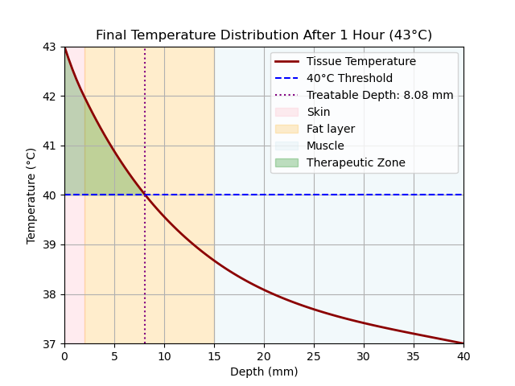
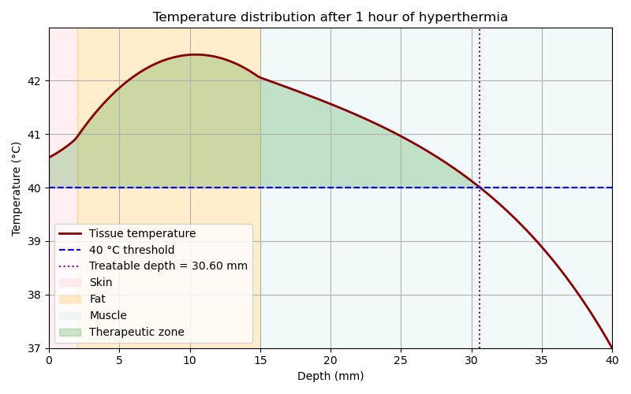
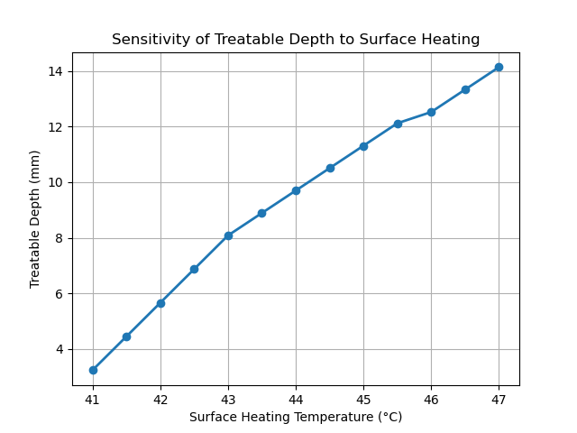

# Hyperthermic Cancer Treatment Simulation
*Academic project | University of Leeds | Python | 2026*

## Overview

Computational simulation of tissue heat diffusion for superficial hyperthermia, a cancer treatment technique that applies localised heat to damage tumour cells while preserving surrounding healthy tissue.

## Methods

The model is based on the **Pennes Bioheat Equation**:
**Pennes Bioheat Equation** : heat diffusion + blood perfusion cooling + metabolic heat + external applicator heat

Solved numerically using the **FTCS finite difference scheme** across a three-layer tissue model (skin / fat / muscle) with literature-sourced physiological parameters.

## Key Parameters

| Parameter | Value |
|---|---|
| Skin thermal conductivity | 0.42 W/(m·K) |
| Fat perfusion rate | 0.00045 1/s |
| Therapeutic threshold | ≥ 40°C |
| Treatment duration | 60 min |
| Water bolus heat transfer coefficient | 100 W/(m²·K) |

## Results

### Model 1 — Surface Heating (43°C)
Treatable depth: **~8 mm** (limited to fat layer)

### Model 2 — SAR + Water-Bolus Cooling
A more clinically realistic model replacing the fixed surface boundary with a Robin condition (ghost-node scheme) to represent water-bolus cooling, combined with a volumetric SAR heat source across tissue layers.

Treatable depth: **~30 mm** — reaching deep into muscle tissue

> Multi-parameter treatment planning analysis (SAR intensity, bolus temperature, heat transfer coefficient) is in progress.

### Sensitivity Analysis
Treatable depth as a function of surface applicator temperature (41°C–47°C):

Surface temperature has a near-linear effect on treatable depth in the clinically safe range, providing a practical control parameter for treatment planning.

## My Contribution

Individual simulation implementation and numerical analysis within a group research project. Responsible for both Python models, parametric sensitivity sweep, and all visualisations.
